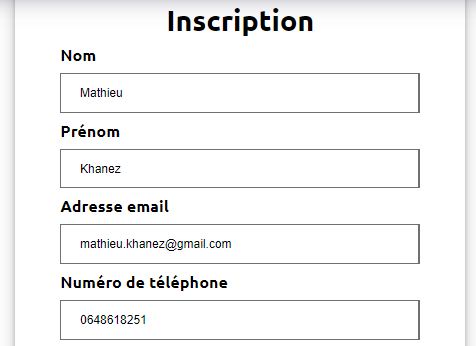
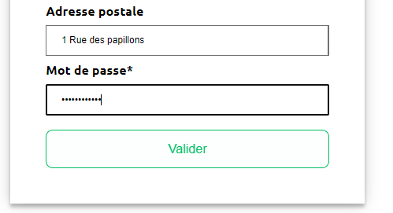
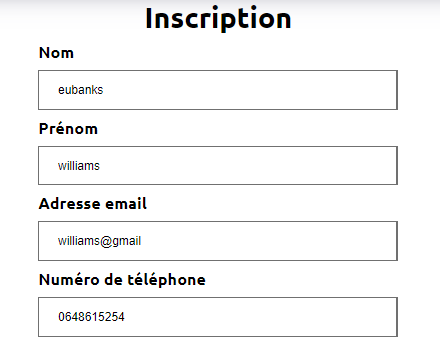
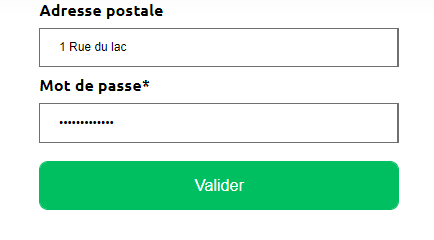

= TESTS
:nofooter:
:toc: left
:icons: font

== Tests du site web

=== Création d'un compte 

==== Test fonctionnel
Lors de ce test, nous vérifions si la création d'un compte depuis le site e-commerce est possible si l'utilisateur saisie des données valides.
Pour ce faire, nous allons crée un nouveau client depuis le site e-commerce. + 
Pour ce faire nous allons entrez les différentes données via le formulaire qui se trouve sur le page inscription.php :

 +

Lors du clique sur le bouton *Valider*, le nouveau client est insérer dans la base de donées et il est désormais possible de ce connecter à celui-ci :

[insérer image]

==== Test non fonctionnel
Lors de ce test, nous vérifions si l'inscription d'un compte depuis le site e-commerce est impossible si l'utilisateur saisie des données non valides. +
Pour ce faire nous allons entrez différentes données via le formulaire qui se trouve sur la page inscription.php :

----
Nom : eubanks
Prénom : williams 
Email : williams@gmail
Mot de passe : williams1
----

 +

Lors du clique sur le bouton *Valider*, le nouveau client ne peut être insérer dans la base de donnée car les données saisies ne se sont pas valides et nous sommes redirigez vers la page d'inscription avec un message d'erreur sur la barre du navigateur :

=== Connexion à un compte

==== Test fonctionnel
Lors de ce test, nous vérifions si la connexion à un compte depuis le site e-commerce est possible si l'utilisateur saisie les bons identifiants. +
Pour ce faire, nous allons nous connecter à un compte depuis le site e-commerce en saisissant de mauvais identifiants. + 
Pour ce faire nous allons entrez les différentes données via le formulaire qui se trouve sur la page connexion.php :

----
Email : christine@gmail.com
Mot de passe : Christine.2211**a
----

[insérer image]

Lors du clique sur le bouton *Me connecter*, la connexion est établie et les informations du client sont accessibles depuis la page où était présent le formulaire de connexion. +
Il est désormais possible pour un utilisateur connecter de se déconnecter ou de modifier les informations de son compte :

[insérer image]

==== Test non fonctionnel 
Lors de ce test, nous vérifions si la connexion à un compte depuis le site e-commerce est impossible si l'utilisateur saisie les mauvais identifiants. +
Pour ce faire nous allons entrez les différentes données via le formulaire qui se trouve sur la page connexion.php :

----
Email : christine@gmail.com
Mot de passe : Christopher.2211
----

[insérer image]

Lors du clique sur le bouton *Me connecter*, la connexion n'est pas établie car les données saisie, en l'occurence le mot de passe ne correspond pas au compte du client. +
L'utilisateur est redirigez vers la page d'accueil avec un message d'erreur :

[insérer image]

=== Déconnexion d'un compte
Lors de ce test, nous vérifions que la déconnexion d'un compte est fonctionnelle. +
Pour ce faire nous devons être connecté à un compte et ce rendre dans la page [.underline]#connexion.php# (mon compte). +
En cliquant sur le bouton *Se déconnecter*, notre session est supprimer et nous somme rediriger vers la page d'accueil. +
Le page [.underline]#connexion.php# affiche le formulaire de connexion :

=== Modifier ses informations 

==== Test fonctionnel
Lors de ce test, nous vérifions que la modifications des informations de son compte est fonctionnelle. +
Pour ce faire, nous devons nous rendre sur la page [.underline]#connexion.php# (mon compte) et cliquer sur le bouton *Modifier* +
Nous sommes redirigez vers la page [.underline]#modification.php# dans laquelle nous saisissons nos nouvelles informations. +
Au clique du bouton *Valider* nous sommes redirigez vers la page [.underline]#connexion.php# et nous constatons que nos informations ont biens étés modifier : 

==== Test non fonctionnel
Lors de ce test, nous vérifions que la modifications des informations de son compte n'est pas fonctionnelle si nous ne rentrons pas des valeurs correct dans les champs du formulaire. +
Pour ce faire, nous devons nous rendre sur la page [.underline]#connexion.php# (mon compte) dans laquelle est présente un formulaire dans lequelle nous rentrons nos nouvelles informations (sans respecter la validité des champs). +
Au clique du bouton *Valider* nous sommes redirigez vers la page [.underline]#connexion.php# (mon compte) et nous constatons que nos informations non pas étés changer et qu'un message d'erreur est présent dans la barre du navigateur : 

=== Recherche des produits

==== Test fonctionnel
Lors de ce test, nous vérifions si il est possible de rechercher des produits via la barre de recherche. +
Pour ce faire nous allons entrez le nom du produit rechercher dans la barre de recherche disponible sur le header : 

[insérer image]

Lors du clique sur le bouton *Entrez*, la recherche est effectuer et l'utilisateur est redirigez vers la page *produits.php* dans laquelle apparaît tous les produits correspondant à sa recherche :

[insérer image]

==== Test non fonctionnel
Lors de ce test, nous vérifions la recherche d'un produit via la barre de recherche dans le cas où le produit est inexistant. +
Pour ce faire nous allons entrez le nom du produits dans la barre de recherche disponible sur le header : 

[insérer image]

Lors du clique sur le bouton *Entrer*, la recherche est effectuer et l'utilisateur est redirigez vers la page *produits.php*. +
Malheureusement, la recherche n'a trouvé aucun produits correspondant au produit saisie par l'utilisateur est donc un message d'erreur apparaît.

[insérer image]

=== Ajout de produit à son panier

==== Test fonctionnel
Lors de ce test, nous vérifions s'il est possible d'ajouter un produit à son panier. +
Pour ce faire nous devons dans un premier temps être connecté et se rendre dans la page des produits. +
Ensuite, nous devons cliquer sur le boutons *Ajouter au panier* du produit que nous souhaitons. +
Le message présent dans l'alerte qui s'affiche doit être un message de succès : 

==== Test non fonctionnel
Lors de ce test, nous vérifions qu'il est impossible d'ajouter des produits à son panier si nous ne sommes pas connecter. +
Nous nous rendons dans la page [.underline]#produit.php# sans se connecter. +
Lorsque nous cliquons sur le boutons : *Ajouter au panier* sur un produit souhaitez, le message présent dans l'alerte doit être un message d'erreur : 

=== Gestion et consultation des produit dans son panier 

==== Supprimer un produit

==== Augmenter la quantité d'un produit

=== Passer commande

==== Test fonctionnel

==== Test non fonctionnel

=== Connexion compte Admin 

==== Test fonctionnel 
Lors de ce test, nous vérifions si la connexion à un compte Administrateur est fonctionnel. +
Pour ce faire dans un premier nous devons nous rendre dans la page [.underline]#connexion.php# dans laquelle nous devons saisir les identifiant de l'entreprise, soit l'email : *RoyalBio@gmail.com* et le mot de passe qui correspond à cet email. +
Nous sommes ensuite redirrigez vers une page qui nous demande le mot de passe Administrateur et lorsque l'on saisit le bon mot de passe, un formulaire de connexion à un compte Administrateur s'affiche. +
Nous saisissons le numéro d'un employé et le mot de passe qui correspond, et une connexion est bien établie :

==== Test non fonctionnel
Lors de ce test, nous vérifions s'il est impossible de se connecter à un compte Administrateur si nous saisissons le mauvais mot de passe. +
Pour ce faire dans un premier nous devons nous rendre dans la page [.underline]#connexion.php# dans laquelle nous devons saisir les identifiant de l'entreprise, soit l'email : *RoyalBio@gmail.com* et le mot de passe qui correspond à cet email. +
Nous sommes ensuite redirrigez vers une page qui nous demande le mot de passe Administrateur et lorsque l'on saisit le bon mot de passe, un formulaire de connexion à un compte Administrateur s'affiche. +
Nous saisissons le numéro d'un employé mais un mot de passe qui ne correspond pas à cet employé. +
La connexion n'est pas établie et nous sommes redirigez vers la page de connexion avec un message d'erreur :

=== Gestion des produits

==== Ajouter un produit

===== Test fonctionnel 
Lors de ce test, nous vérifions si en temps qu'Administrateur il est possible d'ajouter un produit sur le site web. +
Pour ce faire, sur la page d'Administration nous cliquons sur le bouton *Gestion des produits* qui nous redirige sur une page dans laquelle est afficher tous les produits. +
En cliquant sur le bouton *Ajouter un produit*, un formuaire s'affiche dans lequel nous saisissons les données du nouveau produit. +
Lorsque nous cliquons sur le bouton *Valider*, le produit est ajouter sur le site web et nous sommes redirigez vers la page Administration 

===== Test non fonctionnel
Lors de ce test, nous vérifions que si nous insérons de mauvaises données, le produit n'est pas ajouter. +
Pour ce faire, sur la page d'Administration nous cliquons sur le bouton *Gestion des produits* qui nous redirige sur une page dans laquelle est afficher tous les produits. +
En cliquant sur le bouton *Ajouter un produit*, un formuaire s'affiche dans lequel nous saisissons les informations du nouveau produit en ne respectant pas la validité des champs. +
Lorsque nous cliquons sur le bouton *Valider*, le produit n'est pas ajouter sur le site web et nous sommes redirigez vers la page Administration et un message d'erreur est présent dans la barre du navigateur.

==== Modifier un produit

===== Test fonctionnel 
Lors de ce test, nous vérifions si en temps qu'Administrateur il est possible de modifier les informations d'un produit sur le site web. +
Pour ce faire, sur la page d'Administration nous cliquon sur le bouton *Gestion des produits* qui nous redirige sur une page dans laquelle est afficher tous les produits. +
En cliquant sur le *logo de modification* d'un produit, un formulaire s'affiche dans lequel nous saisissons les nouvelles données du produit. +
En cliquant sur le bouton *Valider*, le produit est mise à jour sur le site web et nous sommes redirigez vers la page Administration.

===== Test non fonctionnel
Lors de ce test, nous vérifions si en temps qu'Administrateur il est possible de modifier les informations d'un produit sur le site web. +
Pour ce faire, sur la page d'Administration nous cliquon sur le bouton *Gestion des produits* qui nous redirige sur une page dans laquelle est afficher tous les produits. +
En cliquant sur le *logo de modification* d'un produit, un formulaire s'affiche dans lequel nous saisissons les nouvelles données du produit en ne respectant pas la validité des champs. +
Lorsque nous cliquons sur le bouton *Valider*, le produit n'est pas mis à jour sur le site web et nous sommes redirigez vers la page Administration et un message d'erreur est présent dans la barre du navigateur.

==== Supprimer un client
Lors de ce test, nous vérifions si en temps qu'Administrateur il est possible de supprimer un produit du site web. +
Pour ce faire, sur la page d'Administration nous cliquon sur le bouton *Gestion des produits* qui nous redirige sur une page dans laquelle est afficher tous les produits. +
En cliquant sur le *logo de suppression* d'un produit, celui-ci est supprimer du site web.

=== Gestion des clients

==== Ajouter un client

===== Test fonctionnel 
Lors de ce test, nous vérifions si en temps qu'Administrateur il est possible d'ajouter un client sur le site web. +
Pour ce faire, sur la page d'Administration nous cliquon sur le bouton *Gestion des clients* qui nous redirige sur une page dans laquelle est afficher tous les clients. +
En cliquant sur le bouton *Ajouter un client*, un formulaire s'affiche dans lequel nous saisissons les données du nouveau client. +
En cliquant sur le bouton *Valider*, le nouveau client est ajouter sur le site web et nous sommes redirigez vers la page de *Gestion des clients*.

===== Test non fonctionnel
Lors de ce test, nous vérifions qu'il est impossible d'ajouter un nouveau client sur le site web si les données saisies ne respectent pas la validité des champs. +
Pour ce faire, sur la page d'Administration nous cliquon sur le bouton *Gestion des clients* qui nous redirige sur une page dans laquelle est afficher tous les clients. +
En cliquant sur le bouton *Ajouter un client*, un formulaire s'affiche dans lequel nous saisissons les données du nouveau client en ne respectant pas la validité des champs. +
En cliquant sur le bouton *Valider*, le nouveau client n'est pas ajouter au le site web et nous sommes redirigez vers la page de *Gestion des clients* avec un message d'erreur dans la barre du navigateur.

==== Modifier un client

===== Test fonctionnel 
Lors de ce test, nous vérifions qu'un Administrateur peut modifier les informations des client. +
Pour ce faire, sur la page d'Administration nous cliquon sur le bouton *Gestion des clients* qui nous redirige sur une page dans laquelle est afficher tous les clients. +
En cliquant sur le  *logo de modification*, un formulaire s'affiche dans lequel nous saisissons les nouvelles données du client. +
En cliquant sur le bouton *Valider*, le client est mis à jour sur le site web et nous sommes redirigez vers la page de *Gestion des clients*

===== Test non fonctionnel
Lors de ce test, nous vérifions que les modification d'un Administrateur sur un client ne sont pas mis à jour si les données ne respectent pas les champs. +
Pour ce faire, sur la page d'Administration nous cliquon sur le bouton *Gestion des clients* qui nous redirige sur une page dans laquelle est afficher tous les clients. +
En cliquant sur le  *logo de modification*, un formulaire s'affiche dans lequel nous saisissons les nouvelles données du client en ne respectant pas la validité des champs. +
En cliquant sur le bouton *Valider*, le client n'est pas mis à jour sur le site web et nous sommes redirigez vers la page de *Gestion des clients* et un message d'erreur et afficher dans la barre du navigateur.

==== Supprimer un client
Lors de ce test, nous vérifions qu'un Administrateur peut supprimer un client du site web. +
Pour ce faire, sur la page d'Administration nous cliquon sur le bouton *Gestion des clients* qui nous redirige sur une page dans laquelle est afficher tous les clients. +
En cliquant sur le *logo de suppression*, le compte du client est supprimé et nous sommes redirigez vers la page de *Gestion des clients* +

=== Gestion messagerie client 

== Tests de l'Application

=== Paramétrage 

=== Récupération et affichage des données