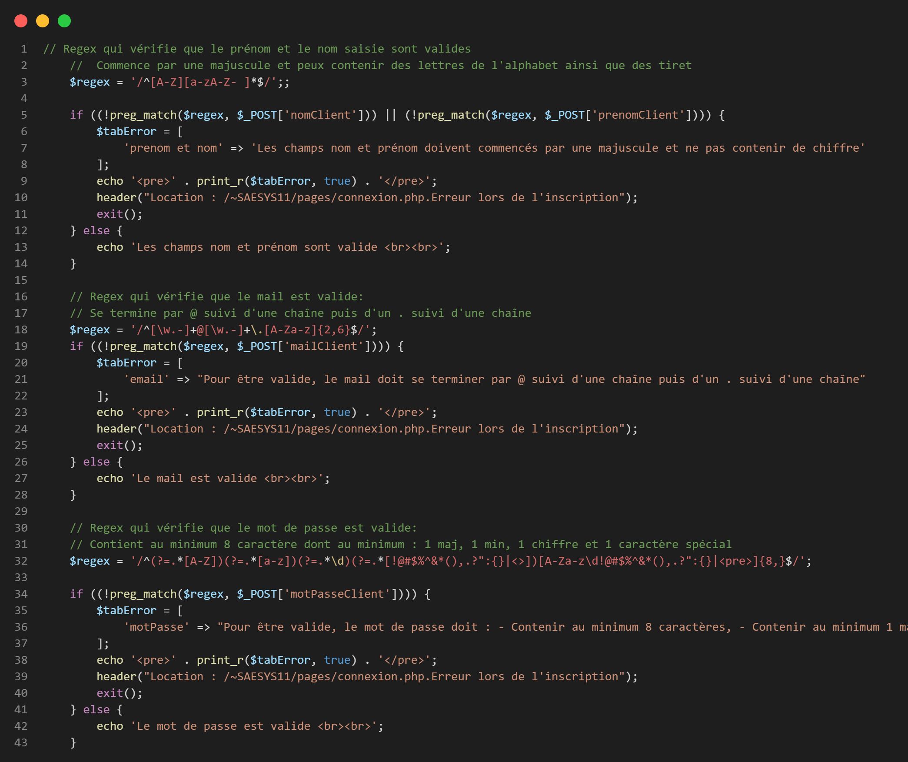
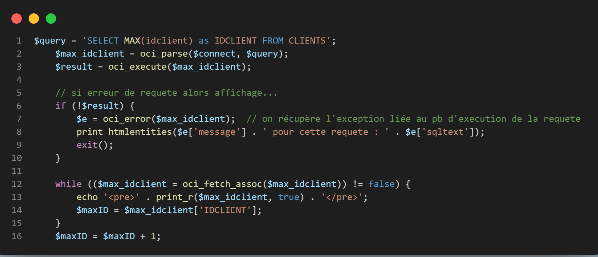
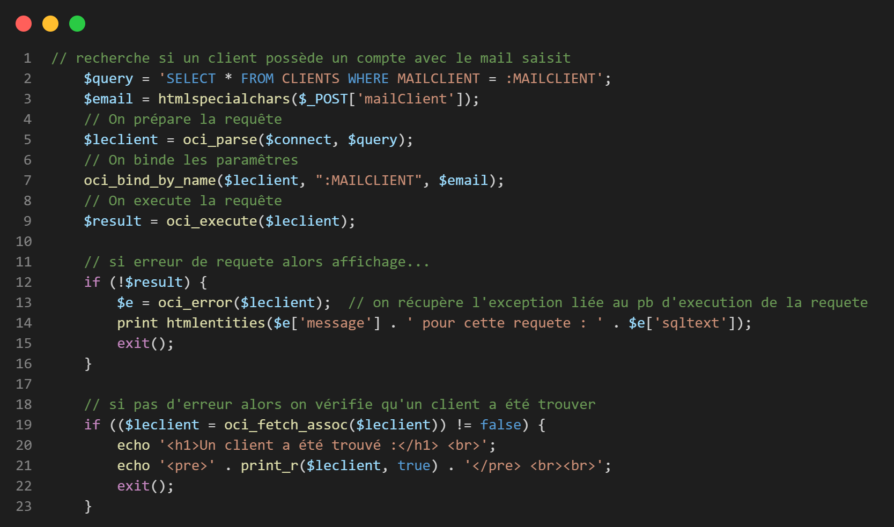
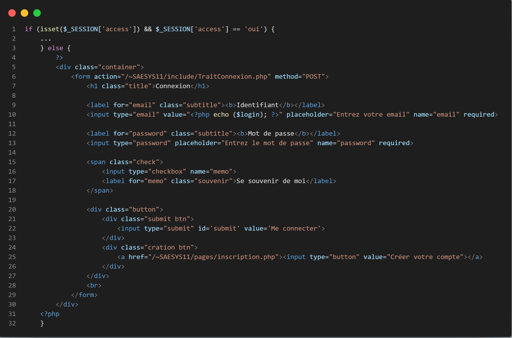
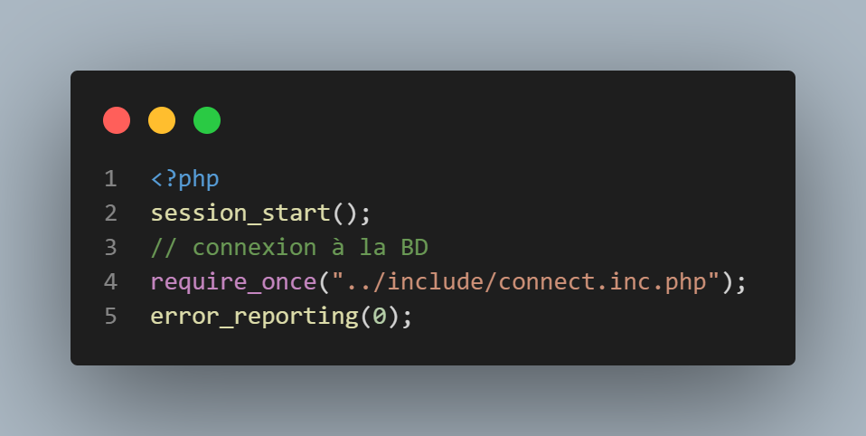
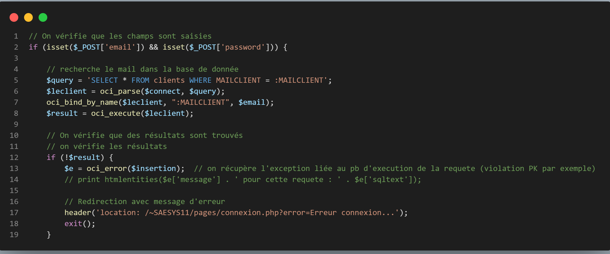
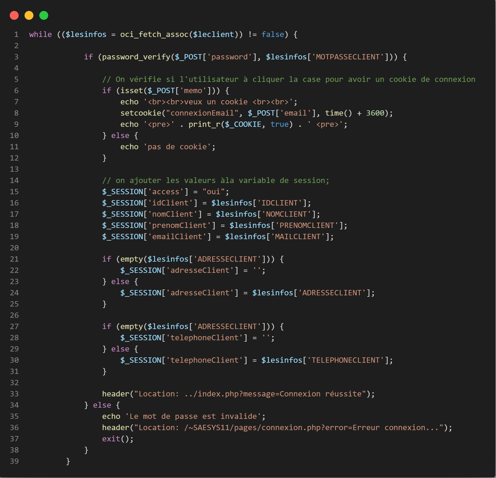
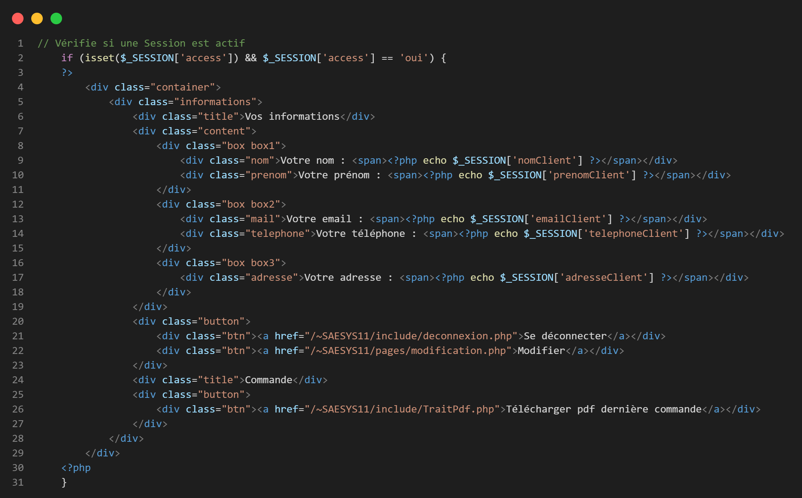
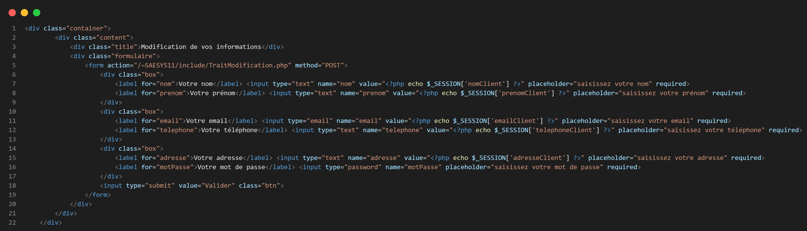
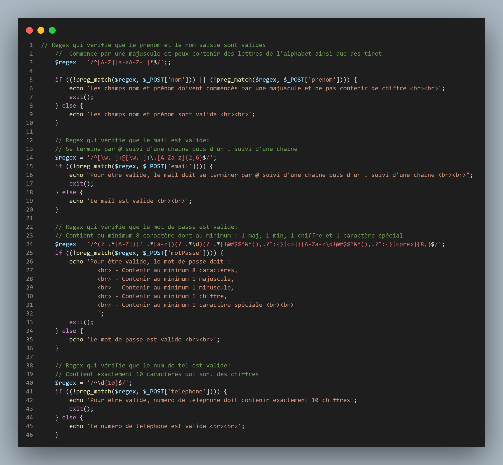

= DOCUMENTATION TECHNIQUE
:nofooter:
:toc: left
:icons: font

== Guide technique du site web

===  Création d'un compte

La création d'un compte sur le site web s'effectue grâce à un formulaire qui sera traité dans le fichier : [.underline]#TraitInscription.php#. + 

image:./img/code_formInscri.png[code du formulaire d'inscription]  +

Pour traiter ce formulaire, dans un premier temps nous devons inclure le fichier qui permet de nous connecter à la base de données : 

image:./img/code_formInscri.png[code du formulaire d'inscription]  +

Ensuite nous mettons en place plusieurs regex qui permettent de vérifier la validité des champs saisie :

* Le nom et le prénom doivent commencer par une majuscule
* Le mail doit se termine par @ suivie d'une chaîne puis d'un point suivie d'une chaîne
* Le mot de passe doit contenir au minimum 8 caractères dont 1 majuscule, 1 minuscule, 1 chiffre et 1 caractère spéciale. 

Ensuite, nous préparons et éxecutons une requête qui recherche la dernière ID des clients pour la stocker dans une variable + 1. Elle sera utilisé comme ID du nouveau client :

Par la suite, nous préparons et éxecutons une requête qui recherche les informations des client qui ont le mail saisie par l'utilisateur. +
Si des résultat sont trouvés, cela veux dire qu'un compte est déjà crée avec cette adresse et donc l'utilisateur doit saisir un nouveau mail :

Si aucun mail est trouvé, alors nous préparons et éxecutons une nouvelle requête SQL qui permet d'insérer dans la base de données le compte avec ses informations : 

=== Connexion à un compte & cookie de connexion

La connexion à un compte sur le site web s'effectue grâce à un formulaire qui sera traité dans le fichier : [.underline]#TraitConnexion.php#. +
Nous vérifions avant tout si une connexion est déjà établie grâce à la variable de *SESSION*, si ce n'est pas le cas nous affichons un formulaire dans lequelle l'utilisateur devra saisir ses informations : 

  +

Pour traiter ce formulaire, dans un premier nous devons lancer la session et inclure le fichier qui permet de nous connecter à la base de données : 

  +

Ensuite, dans une conditions qui vérifie que les champs ont bien été saisies, nous préparons et exécutons une requête qui recherche le mail saisie par l'utilisateur dans la base de données : 

  +

Si un mail est trouvé dans la base de données, nous vérifions que le mot de passe saisie par l'utilisateur correspond à ce mail. +
Si c'est le cas une session est crée avec les informations du client et ce dernier et redirigez vers la page d'accueil. +
De plus, une condition vérifie si l'utilisateur à choisi d'avoir un cookie de connexion. Si c'est le cas celui-ci est crée avec pour valeur le mail du client ce qui aura pour effet de pré-remplir les champs lors de sa prochaine connexion : 

  

=== Consulter et modifier ses informations

La consultation des informations d'un client s'effectue depuis la page [.underline]#Connexion.php#. +

Nous vérifions si une *SESSION* est crée est si la clé *access* à pour valeur *oui*. +
Si c'est le cas, nous affichons les informations de l'utilisateur : 

Pour accéder à la modification de ses informations, le client doit cliquer sur le bouton : *Modifier* qui le redirige vers la page : [.underline]#modification.php# dans laquelle est présent un formulaire qui sera traité dans la page : [.underline]#TraitModification.php# : 

Pour traité se formulaire, lançons d'abord la *SESSION* et incluons le fichier qui permet de se connecter à la base de données :

Ensuite, nous mettons en place plusieurs regex qui vérifie que : 

* Le nom et le prénom doivent commencer par une majuscule
* Le mail doit se termine par @ suivie d'une chaîne puis d'un point suivie d'une chaîne
* Le mot de passe doit contenir au minimum 8 caractères dont 1 majuscule, 1 minuscule, 1 chiffre et 1 caractère spéciale. 
* Le numéro de téléphone doit contenir exactement 10 chiffre

=== Rechercher et consultation des produits

=== Ajouter des produits au panier

=== Gérer les produits de sont panier

=== Réaliser une commande

=== se connecter à un compte Administrateur

=== Gérer les produits

=== Gérer les clients

== Guide technique de l'Application IOT