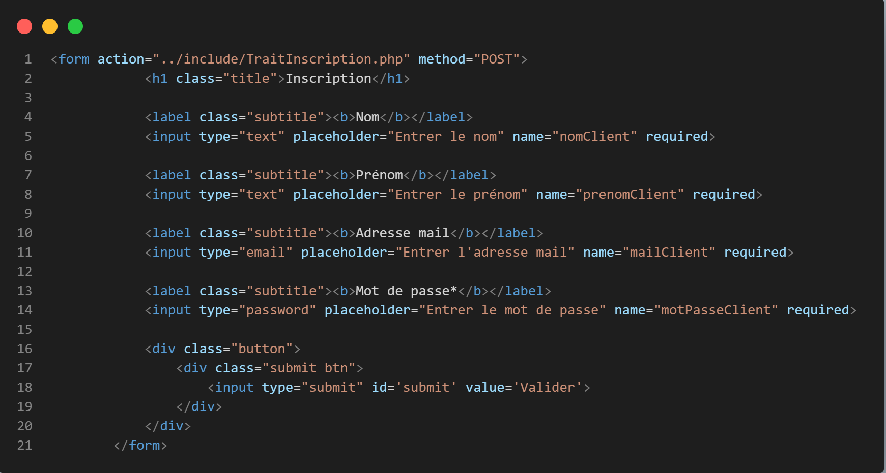
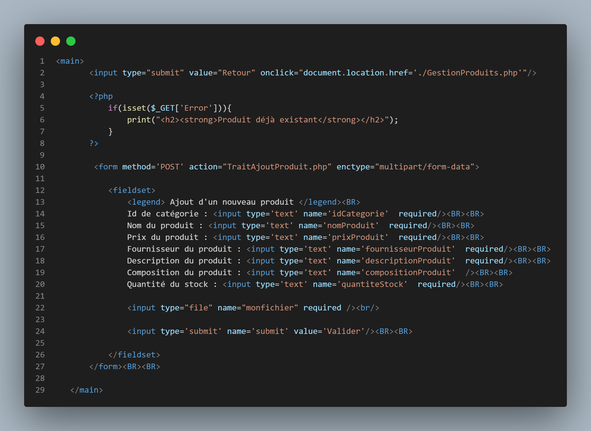

= DOCUMENTATION TECHNIQUE
:nofooter:
:toc: left
:icons: font

== Guide technique du site web

===  Création d'un compte

La création d'un compte sur le site web s'effectue grâce à un formulaire qui sera traité dans le fichier : [.underline]#TraitInscription.php#. + 

  +

Pour traiter ce formulaire, dans un premier temps nous devons inclure le fichier qui permet de nous connecter à la base de données : 

  +

Ensuite nous mettons en place plusieurs regex qui permettent de vérifier la validité des champs saisie :

* Le nom et le prénom doivent commencer par une majuscule
* Le mail doit se termine par @ suivie d'une chaîne puis d'un point suivie d'une chaîne
* Le mot de passe doit contenir au minimum 8 caractères dont 1 majuscule, 1 minuscule, 1 chiffre et 1 caractère spéciale. 

Ensuite, nous préparons et éxecutons une requête qui recherche la dernière ID des clients pour la stocker dans une variable + 1. Elle sera utilisé comme ID du nouveau client :

image:./img/code_idMax.png[code de la requête SQL]

Par la suite, nous préparons et éxecutons une requête qui recherche les informations des client qui ont le mail saisie par l'utilisateur. +
Si des résultat sont trouvés, cela veux dire qu'un compte est déjà crée avec cette adresse et donc l'utilisateur doit saisir un nouveau mail :

image:./img/code_mailPresent.png[code de la requête SQL]

Si aucun mail est trouvé, alors nous préparons et éxecutons une nouvelle requête SQL qui permet d'insérer dans la base de données le compte avec ses informations : 

image:./img/code_mailPresent.png[code de l'ajout d'un compte client]

=== Connexion à un compte & cookie de connexion

La connexion à un compte sur le site web s'effectue grâce à un formulaire qui sera traité dans le fichier : [.underline]#TraitConnexion.php#. +
Nous vérifions avant tout si une connexion est déjà établie grâce à la variable de *SESSION*, si ce n'est pas le cas nous affichons un formulaire dans lequelle l'utilisateur devra saisir ses informations : 

image:./img/code_formConn.png[code du formulaire de connexion]  +

Pour traiter ce formulaire, dans un premier nous devons lancer la session et inclure le fichier qui permet de nous connecter à la base de données : 

image:./img/code_connBD.png[code de la connexion à la BD]  +

Ensuite, dans une conditions qui vérifie que les champs ont bien été saisies, nous préparons et exécutons une requête qui recherche le mail saisie par l'utilisateur dans la base de données : 

image:./img/code_rechercheMail.png[code de la requête SQL]  +

Si un mail est trouvé dans la base de données, nous vérifions que le mot de passe saisie par l'utilisateur correspond à ce mail. +
Si c'est le cas une session est crée avec les informations du client et ce dernier et redirigez vers la page d'accueil. +
De plus, une condition vérifie si l'utilisateur à choisi d'avoir un cookie de connexion. Si c'est le cas celui-ci est crée avec pour valeur le mail du client ce qui aura pour effet de pré-remplir les champs lors de sa prochaine connexion : 

  

=== Se déconnecter 

La connexion est caractériser par la création d'une *SESSIONS* et éventuellement d'un cookie de connexion. +
Pour permettre la deconnexion, il faut donc détruire cette *SESSIONS* et éventuellement le cookie de connexion. + 
Cette deconnexion est traité par le fichier : [.underline]#deconnexion.php# : 

  

Avant tous, nous lançons la *SESSIONS* et nous supprimons toutes les valeurs de celles-ci et en mettant la valeur *non* pour la clé *access*. +
Ensuite, si un cookie de connexion est présent, nous le détruisons. +
L'utilisateur est finalement redirigez la page d'accueil avec un message de déconnexion réussite dans la barre du navigateur.

=== Consulter et modifier ses informations

La consultation des informations d'un client s'effectue depuis la page [.underline]#Connexion.php#. +

Nous vérifions si une *SESSION* est crée est si la clé *access* à pour valeur *oui*. +
Si c'est le cas, nous affichons les informations de l'utilisateur : 

image:./img/code_pageInfo.png[code de la page informations]

Pour accéder à la modification de ses informations, le client doit cliquer sur le bouton : *Modifier* qui le redirige vers la page : [.underline]#modification.php# dans laquelle est présent un formulaire qui sera traité dans la page : [.underline]#TraitModification.php# : 

Pour traité se formulaire, lançons d'abord la *SESSION* et incluons le fichier qui permet de se connecter à la base de données :

image:./img/code_connBD.png[code de la connection à la BD]

Ensuite, nous mettons en place plusieurs regex qui vérifie que : 

* Le nom et le prénom doivent commencer par une majuscule
* Le mail doit se termine par @ suivie d'une chaîne puis d'un point suivie d'une chaîne
* Le mot de passe doit contenir au minimum 8 caractères dont 1 majuscule, 1 minuscule, 1 chiffre et 1 caractère spéciale. 
* Le numéro de téléphone doit contenir exactement 10 chiffre

=== Recherche et consultation des produits

La consultation des produits se fait de deux manières différentes : grâce au *catégorie* et à la *barre de recherche*. +
Elles se font dans la page : [.underline]#produit.php#. +
Au clique de chaque catégorie, l'information *recherche* de la barre du navigateur est mise à jour : 

Cette information sera traité sur la page : [.underline]#produit.php# dans un *switch*. +
Pour chaque *case*, une requête SQL différente sera mise en place selon la catégorie (l'information *recherche*) : 

le *default* de se switch sera utilisé pour la barre de recherche : 

Pour afficher les produit, dans un premier temps nous préparons et éxecutons la requête selon le *case* du *switch*. +
Si il n'y a pas d'erreurs, nous parcourons les résultats et nous affichons les produits et leurs informations :

=== Ajouter des produits au panier

L'ajout d'un produit dans son panier est traité dans la page : [.underline]#produit.php# et dans la page [.underline]#AjoutAuPanier.php# +

Nous vérifions avant tous que l'utilisateur est connecté à un compte : nous créeons une variable qui prend comme valeur : 

* si l'utilisateur est connecté, la valeur de cet variable prend *l'IDCLIENT*
* si l'utilisateur n'est pas connecté, la valeur de cet variable prend : 0

Ensuite dans page [.underline]#AjoutAuPanier.php#, nous appelons dans un premier temps la fonction *ajoutAuPanier()* : 

Pour fonctionner, dans un premier temps cette fonction vérifie si l'utilisateur est connecté. +
Si c'est le cas, nous préparons et éxecutons la procédure *ADD_TO_CART* qui ajoute le produit au panier : 

Dans les cas d'erreur et de réussite, une alerte est afficher présentant le message soit d'erreur ou de réussite : 

image:./img/code_showAlert.png[code de la fonction d'alerte]

=== Gérer les produits de son panier

==== Modifier la quantité d'un produit

La modification de la quantité d'un produit dans le panier d'un client est effectuer dans la page : [.underline]#include/fonctions.php#.

==== Supprimer un produit de son panier 

=== Réaliser une commande

=== se connecter à un compte Administrateur

La connexion à un compte Administrateur sur le site web s'effectue en suivant plusieurs étapes. +
Dans un premier temps, une connexion doit être établie pour se rendre sur la page d'Administration grâce au formulaire de la page [.underline]#connexion.php# qui sera traité dans la page : [.underline]#TraitConnexion.php#. +

Nous vérifions que l'email saisie par l'utilisateur est bien le mail permettant d'accéder à la page d'Administration : *RoyalBio@gmail.com* et que le mot de passe saisie correspond à cette email. +
Si c'est le cas, l'utilisateur est redirigez vers la page Administration :

image:./img/code_showAlert.png[code de la fonction d'alerte]

L'input qui permet de redirigez l'utilisateur vers le formulaire lui permettant de se connecter à son compte Administrateur est traité dans la page : [.underline]#firstConAdmin.php# : 

image:./img/code_firstConnAdmin.png[code de la première connexion Administrateur]

Si le mot de passe saisie correspond au mot de passe pour accéder au formulaire de connexion alors l'utilisateur est redirigez vers la page : [.underline]#connexionAdmin.php# dans laquelle est présente un formulaire qui est traité dans la page [.underline]#TraitconnexionAdmin.php# (à noter que la SESSION qui a été crée lors de la première connexion est détruite) : 

Pour traité ce formulaire, nous verifions d'abord si les champs saisies et nous préparons et éxecutons une requête SQL qui recherche toutes les informations de l'Administrateur qui a pour numéro d'employé, le *numEmp* saisie. +
Si un employé est trouvé, et que le mot de passe saisie correspond au compte de cet employé, une *SESSION* et donc une connexion sont établie : 

=== Gérer les produits

==== Ajouter un produit

L'ajout d'un produit est faite grâce à un formulaire dans la page [.underline]#AjoutProduit.php# qui est traité dans la page  [.underline.]#TraitAjoutProduit# :

Pour traité se formulaire, nous vérifions que les différents champs ont étés saisies et différentes regex : 

Ensuite, nous préparons et éxecutons une requête SQL qui permet de rechercher les produits et les ajouter à un tableau. +
    

Ensuite nous vérifions que le produit à créer n'existe pas déjà et on incrément la valeur de *l'idProduit* :

Enfin nous insérons dans la base de données le nouveau produit crée : 

==== Modifier un produit

==== Supprimer un produit

=== Gérer les clients

=== Gérer la messagerie client 

== Guide technique de l'Application IOT

=== Partie Python

=== Partie Java