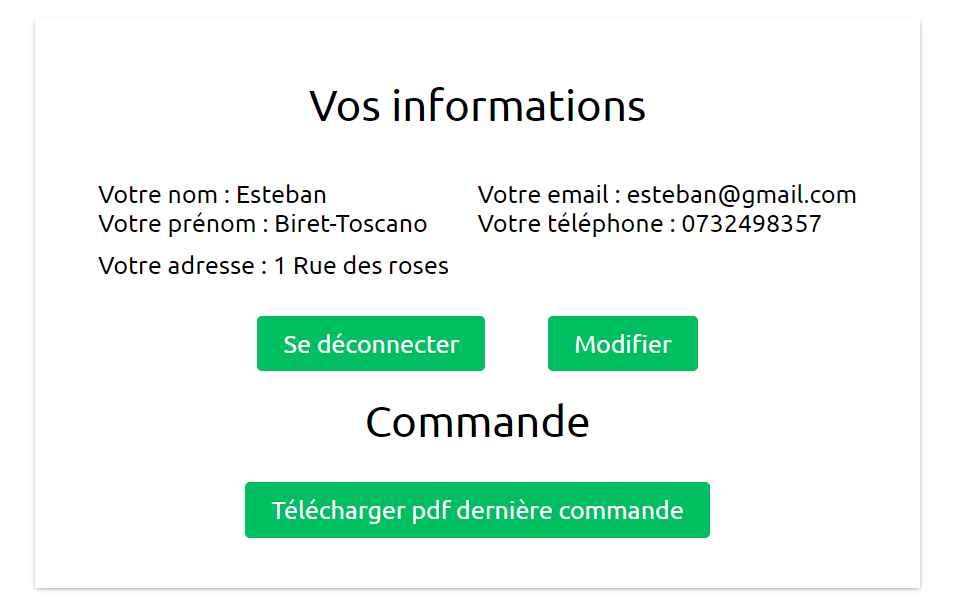

= DOCUMENTATION UTILISATEUR
:nofooter:
:toc: left
:icons: font

== Guide du site web

=== Crée un compte 

Pour crée un compte client, rendez-vous sur page : [.underline]#Connexion# en cliquant sur le lien disponible sur *l'en-tête* et cliquer sur le bouton : [.underline]#Créer un compte chez Royal Bio# pour être redirigez vers le formulaire de création d'un compte : +
Saissisez ensuite les différent champs et valider en cliquant sur le bouton : *Valider* +

  +

.La création d'un compte Royal Bio ne peut être validée si l'un des cas suivant n'est pas respecter : 

. Les champs : _Nom_ et _Prénom_ contiennent un chiffres
. Le champs _mail_ ne contient pas le symbole : *@*
. Le champs _mot de passe_ doit contenir au minimum 8 caractères, sachant qu'il doit y avoir au minimum 
.. une majuscule
.. une minuscule
.. un caractère spécial

=== Se connecter à un compte

Pour se connecter à un compte client, rendez-vous sur la page : [.underline]#Connexion# en cliquant sur le lien disponible sur *l'en-tête* et entrez les informations demander, à savoir le mail et le mot de passe. +

  +

Au clique du bouton : [.underline]#Se connecter#, si ces deux informations ne sont pas erroné la connection est établie. +

  +

=== Recherche et consulter des produits

Pour consulter les produits d'une catégorie spécifique, sélectionner celle-ci dans le sous-menu de *l'en-tête* +

  +

  +

Pour rechercher un produit spécifique, utilisez la barre de recherche disponible sur *l'en-tête*

  +

  +

WARNING: La recherche peut échouer, votre produit n'existe peut-être pas ou vérifiez l'ortographe 

=== Ajouter et consulter des produits dans son panier

WARNING: Pour utiliser cette fonctionnalité, l'utilisateur doit être connecté à un compte

Pour ajouter un produit à son panier, le client doit dans un premier temps se rendre sur la page des produits et cliquer sur le bouton : [.underline]#Ajouter au panier# du produit désirer (une alerte s'affiche) : +

  +

  +

Pour consulter les produits de son panier, le client doit se rendre sur la page de son panier en cliquant sur le logo représentatif sur *l'entête* : +

  +

  

=== Gérer les produits dans son panier 

==== Modifier la quantité d'un produit

WARNING: Pour utiliser cette fonctionnalité, l'utilisateur doit être connecté à son compte

Pour modifier la quantité d'un produit dans son panier, le client doit se rendre dans la page [.underline]#panier.php#.
Depuis cette page, en saisissant une quantité dans le champs dédié et en cliquant sur le bouton *Mettre à jour*, la quantité du produit sera modifié :

==== Supprimer un produit de son panier

WARNING: Pour utiliser cette fonctionnalité, l'utilisateur doit être connecté à son compte

Pour supprimer un produit de son panier, le client doit se rendre dans la page [.underline]#panier.php#.
Depuis cette page, en cliquant sur le bouton *Supprimer* du produit, celui-ci sera supprimer de son panier :

=== Réaliser une commande

WARNING: Pour utiliser cette fonctionnalité, l'utilisateur doit être connecté à son compte et posséder un panier

Pour réaliser une commande à la suite de la création d'un panier, le client doit se rendre dans la page [.underline]#panier.php# ou il devra cliquer sur le bouton *Passer la commande* : 

Il sera rediriger vers une page dans laquelle sera présente un formulaire ou il devra saisir ces informations de livraison ainsi que de paiement : 

=== Envoyer un message à Royal Bio

WARNING: Pour utiliser cette fonctionnalité, l'utilisateur doit être connecté à son compte

Pour envoyer un message à Royal Bio, le client devra se rendre sur la page : [.udnerline]#contact.php# dans laquelle sera accessible des champs dans lesquels il devra saisir ses informations ainsi que l'objet de son message et ce dernier : 

Lorsque le client cliquera sur le bouton : *envoyer*, le message sera envoyé à Royal Bio pour qu'ils y réponde : 

=== se connecter à un compte Administrateur

Pour se connecter à un compte Administrateur, rendez-vous sur la page : [.underline]#Connexion#. +
Depuis cette page, saisissez les informations administrateur dans le formulaire : +

  +

Si ces informations sont valides, l'utilisateur sera redirigez vers une page lui demandant le mot de passe des Administrateurs : +

  +

Si le mot de passe saisit est valide, il sera redirigez à nouveau vers une page dans laquelle est présente un formulaire de connexion où il devra saisir sont numéro d'employé et le mot de passe associé à ce numéro : +

  +

Si les informations saisies sont correct, l'utilisateur est redirigez vers une page dans laquelle sont présent des boutons permettant respectivement de redirigez vers les pages pour faire le CRUD des clients et des produits ainsi que gérer les messages clients : 

  +

=== Gérer les produits (CRUD des produits)

WARNING: Pour utiliser cette fonctionnalité, l'utilisateur doit être connecté à un compte administrateur. 

Pour faire le CRUD des produits, l'administrateur doit cliquer sur le bouton : *Gérer les produits* depuis la page [.underline]#Administrateur# : 

  +

ce qui aura pour effet de le redirigez vers une page dans laquelle la liste de touts les produits est présente dans un tableau :

  +

Depuis cette page, l'Administrateur aura la possibilité de faire trois actions différentes : +

* Ajouter un produit
* Modifier les informations d'un produit
* Supprimer un produit

La fonctionnalité permettant d'ajouter un produit redirige l'administrateur vers une page dans laquelle est présente un formaulaire dans lequel il est invité à entrer les nouvelles informations : 

  +

La fonctionnalité permettant de modifier les informations d'un produit redirige l'Administrateur vers une page dans laquelle est présente un formulaire dans lequel il est invité à entrer les nouvelles informations : 

  +

=== Gérer les clients (CRUD des clients)

WARNING: Pour utilliser cette fonctionnalité, l'utilisateur doit être connecté à un compte administrateur.

Pour faire le CRUD des clients, l'administrateur doit cliquer sur le bouton : *Gestion des clients* depuis la page [.undeline]#Administrateur# : 

  +

ce qui aura pour effet de le redirigez vers une page dans laquelle est présente la liste des clients du site dans un tableau : 

  +

Depuis cette page, l'administrateur aura la possibilité de faire trois actions différentes : +

* Ajouter un client 
* Modifier les informations d'un client
* Supprimer un client

La fonctionnalité permettant d'ajouter un client redirige l'administrateur vers une page dans laquelle est présente un formaulaire dans lequel il est invité à entrer les nouvelles informations : 

  +

La fonctionnalité permettant de modifier les informations d'un client redirige l'administrateur vers une page dans laquelle est présente un formulaire dans lequel il est invité à entrer les nouvelles informations : 

 

=== Gérer la messagerie clientèle

WARNING: Pour utiliser cette fonctionnalité, l'utilisateur doit être connecté avec un compte administrateur

Pour gérer la messagerie clientèle, à savoir consulter les message reçu et y répondre, l'Administrateur sur la page *d'Administration* doit cliquez sur le bouton *MEssagerie clients* :

 

Il sera rediriger vers une page dans laquelle sera présente tous les messages reçu :

En cliquant sur un message précis, celui-ci sera afficher et l'Administrateur poura y répondre :

 

== Guide de l'Application IOT
